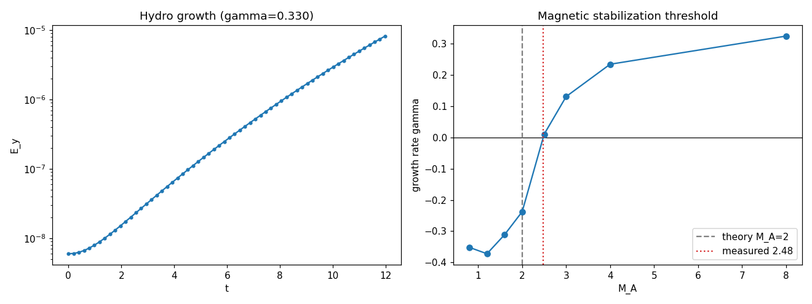
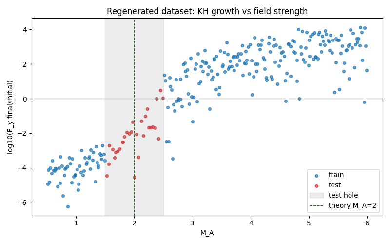
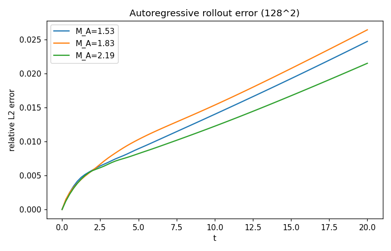
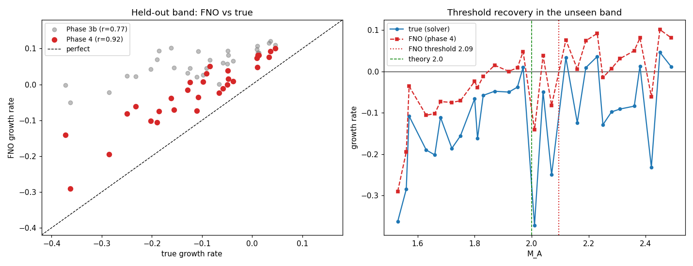
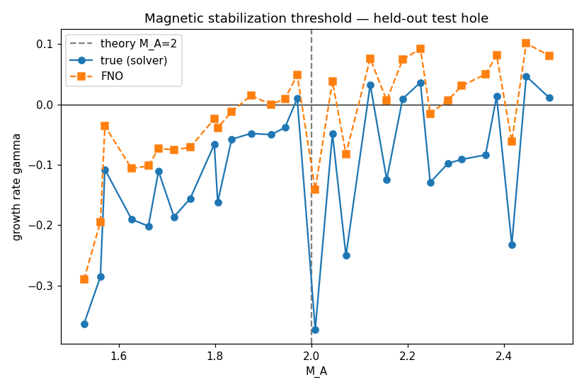

# MHD Instability Neural Operator (`mhd-fno`)

**A Fourier Neural Operator trained to emulate the nonlinear evolution of a magnetized
Kelvin–Helmholtz instability — and a rigorous test of whether it learns the underlying
*physics* rather than interpolating the data.**

**Headline result:** trained on data that deliberately excludes the band
$M_A \in [1.5, 2.5]$ around the magnetic stabilization threshold, the operator
reconstructs the growth-rate curve inside that unseen band with correlation $0.92$ and
places the threshold at $M_A \approx 2.1$ (solver: $\approx 2.5$; vortex-sheet theory:
$2.0$). Getting there required diagnosing *why* a naive field loss makes the instability
invisible — the central technical finding below.

Everything here is built from scratch: the pseudo-spectral MHD solver that generates the
ground truth, the dataset, the neural operator, and the physics diagnostics.

---

## The scientific question

A shear layer in a conducting fluid rolls up into Kelvin–Helmholtz (KH) vortices. An
in-plane magnetic field aligned with the flow resists the roll-up through magnetic
tension, and above a critical field strength the instability is **suppressed**. In terms
of the Alfvénic Mach number,

$$
M_A = \frac{\Delta v}{v_A}, \qquad v_A = \frac{B_0}{\sqrt{\mu_0 \rho}},
$$

linear theory for a vortex sheet places the marginal point at $M_A \approx 2$: unstable
above, stable below.

A neural operator can obviously be trained to *look* like the solver. The sharper
question — and the one this project is built around — is:

> **Can the operator recover the magnetic stabilization threshold in a region of
> parameter space it has never seen?**

To answer it honestly, the training set deliberately **excludes** a band around the
threshold, $M_A \in [1.5, 2.5]$; that band is used only at test time. Interpolation
cannot succeed there — only physics can.

---

## Approach

**1 — Ground truth: a pseudo-spectral MHD solver.**
2D incompressible MHD in a doubly periodic box, written in PyTorch. The state is two
scalar fields: vorticity $\omega$ and the fluctuating magnetic flux potential $a$, with
the aligned mean field $B_0$ carried as a parameter. This representation makes
$\nabla\cdot\mathbf{v} = 0$ and $\nabla\cdot\mathbf{B} = 0$ exact by construction.
Derivatives are spectral, nonlinear products are formed in real space with 2/3
dealiasing, and time stepping is RK4 under advective *and* diffusive stability limits.

**2 — Dataset.** 280 simulations at $128^2$ (81 frames each), Latin-Hypercube sampled
over $M_A \in [0.5, 6]$ and $\mathrm{Re} \in [500, 5000]$ at $\mathrm{Pm} = 1$, with the
held-out threshold band described above.

**3 — Operator.** A Fourier Neural Operator learning the one-step map
$(\omega, a)_t \mapsto (\omega, a)_{t+\Delta t}$, conditioned on $(M_A, \mathrm{Re})$,
applied autoregressively for the full trajectory.

---

## Results

### 1. The solver reproduces linear theory



Growth is cleanly exponential and **resolution-converged** ($\gamma$ unchanged from
$128^2$ to $256^2$, fit $R^2 = 1.0000$). The measured stabilization threshold sits at
$M_A \approx 2.5$, close to the vortex-sheet prediction of $2$ — the offset is expected,
since a shear layer of finite thickness is somewhat harder to destabilize than an ideal
sheet.

### 2. The dataset spans the threshold



Transverse kinetic energy $E_y$ decays below $M_A \approx 2$ and grows above it. Training
points (blue) avoid the grey band; test points (red) fill it.

### 3. The FNO is a faithful, resolution-independent field surrogate



Rolled out autoregressively for 80 steps, the relative $L^2$ field error stays **below
2.5%**, with no blow-up. This rollout is at $128^2$ using weights trained at $64^2$:
**resolution independence holds in practice**, not just in principle.

### 4. Recovering the growth rate is much harder than recovering the field

This is the central finding.

A naive field loss produces an excellent-looking surrogate that is **blind to the
instability**. The reason is a separation of scales: the field is dominated by the static
shear layer ($\omega \sim 2.5$), while the growing perturbation that determines
stability is orders of magnitude smaller. The model's field error ($\sim 0.03$) is larger
than the entire signal of interest, so a field-norm loss has no incentive to capture it —
predicted $E_y$ stayed flat even for runs whose true $E_y$ grew by $10^4$.

Three successive changes to the training objective were required:

| Training scheme | Predicted $\gamma$ | corr. with truth | bias | sign correct |
|---|---|---|---|---|
| Full-field loss only | flat at $0$ — instability invisible | — | — | — |
| \+ perturbation-only loss (Reynolds decomposition, scale-invariant) | grows *everywhere* — shape learned, rate not | — | — | — |
| \+ multi-step (rollout) training, $K=4$, subsampled data | tracks the truth, strong positive bias | $0.77$ | $+0.168$ | 33% |
| \+ full data, $K=6$, GPU-trained | **tracks the truth closely** | $\mathbf{0.92}$ | $+0.089$ | **73%** |



### 5. The threshold is recovered in the unseen band



In its final form the operator **reproduces the growth-rate curve across the held-out
band it was never trained on**, including run-to-run structure driven by $\mathrm{Re}$
and the perturbation seed — not merely the trend with $M_A$. A linear fit through its
predictions crosses zero at

$$
M_A^{\text{FNO}} \approx 2.1,
$$

against $\approx 2.5$ measured from the solver itself and $2.0$ from vortex-sheet theory.

**Honest assessment.** This is a genuine recovery of the magnetic stabilization
threshold from data that excluded it: correlation $0.92$, and the operator now assigns
the correct sign (growing vs decaying) to 73% of held-out runs, up from 33%. A residual
positive bias ($+0.089$) remains — stable runs are still under-damped — which shifts the
predicted crossing to somewhat lower $M_A$ than the solver's own. The validation loss was
still falling when training stopped, so this is a floor on achievable accuracy, not a
ceiling.

---

## What this project demonstrates

- End-to-end ownership of the full chain: **physics → numerics → data → deep learning →
  evaluation**, with no black boxes.
- A solver validated against analytic linear theory, not merely "looking plausible".
- An experimental design (the held-out threshold band) that makes the central claim
  **falsifiable**.
- Two genuine debugging results found by rigorous checking rather than assumed away: a
  time-step instability that silently corrupted 4% of the dataset, and an
  under-resolved shear layer.
- A negative-leaning result reported honestly and diagnosed mechanistically, instead of a
  cherry-picked success.

## Limitations and future work

- **Residual positive bias** ($+0.089$) in the predicted growth rate: stable runs are
  under-damped, shifting the predicted threshold below the solver's own. Training had not
  converged when it stopped, so more epochs, full-resolution ($128^2$) training, larger
  capacity and longer rollout horizons are all untried headroom.
- **High-wavenumber noise**: the operator adds spurious energy at small scales that the
  solver dissipates (see `notebooks/spectrum.png`).
- Ground-truth growth rates inside the marginal band are themselves noisy over the
  simulated horizon, which limits how sharply the test can discriminate.
- Only KH is covered; current-driven (kink) and magnetorotational instabilities are the
  planned extensions.

---

## Reproducing

```bash
python -m venv .venv && source .venv/bin/activate
pip install -r requirements.txt && pip install -e .

python scripts/generate_data.py --config configs/kh_baseline.yaml   # ~3 h, 2.8 GB
python scripts/validate_solver.py                                   # solver vs theory
python scripts/train.py --config configs/kh_baseline.yaml \
    --epochs 20 --rollout-steps 6 --fluct-weight 1.0
python scripts/evaluate.py --config configs/kh_baseline.yaml \
    --ckpt checkpoints/fno_best.pt --normalizer checkpoints/normalizer.json
```

Training uses CUDA or Apple MPS automatically when available (`--device` to force one).
`pytest` runs the full test suite (42 tests: spectral operators against analytic
derivatives, solver stability and physics regressions, data pipeline, model, losses).

## Repository layout

```
src/mhd_fno/
├── solver/      # pseudo-spectral 2D MHD solver (spectral ops, KH initial state, engine)
├── data/        # parameter sweep, HDF5 generation, Dataset, normalization
├── models/      # Fourier Neural Operator
├── training/    # losses (incl. perturbation loss), trainer with multi-step rollout
├── evaluation/  # growth rates, rollout, energy spectra
└── utils/       # device selection
configs/  scripts/  tests/  notebooks/
```

## Physics conventions

$$
\mathbf{v} = \nabla\times(\psi\,\hat{z}), \quad
\mathbf{B} = \nabla\times(A\,\hat{z}), \quad
\omega = -\nabla^2\psi, \quad A = B_0\,y + a
$$

The mean field is split off because a uniform $\mathbf{B}$ has a non-periodic flux
potential; $a$ is periodic and is what the network evolves. Primitive fields are
reconstructed from $(\omega, a)$ by a spectral Laplacian inversion for diagnostics.
Normalized units: $\mu_0 = \rho = 1$, so $v_A = B_0$ and $B_0 = \Delta u / M_A$.

See [`ROADMAP.md`](ROADMAP.md) for the phase-by-phase plan and design decisions.
